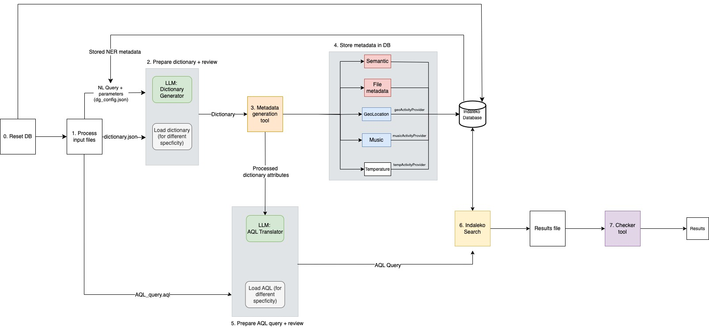

# Workflow of Pipeline

## Script Locations

- **Indaleko/data_generator/s1_metadata_generator.py**  
  Creates the metadata with the given config file.
- **Indaleko/data_generator/s2_store_metadata.py**  
  Directly uploads the metadata to the Indaleko DB.
- **Indaleko/data_generator/s3_translate_query.py**  
  Translates the NL query into an input suitable for data generator (formatted dictionary).
- **Indaleko/data_generator/s4_translate_AQL.py**  
  Translates the dictionary into an AQL statement.
- **Indaleko/data_generator/s5_get_precision_and_recall.py**  
  Calculates precision and recall of the resulting Indaleko search.
- **Indaleko/data_generator/s6_log_result.py**  
  Logs the progress of the pipeline workflow, including epoch time, outputs, and any errors. Outputs final result and progress log files.
- **Indaleko/metadata**  
  Consists of scripts for the metadata generation for `s1_metadata_generator.py`.

## Metadata Generation Workflow

### Config Processor
Extracts parameters specified by the user in the config file:
- **Output_json**: Location of output.
- **N_metadata_records**: Total number of records to create.
- **N_matching_queries**: Total number of truth metadata to create from the total.
- **Query**: The NL query.

### Prepare Dictionary + Review
- Users can choose to use an already populated `/config/dictionary.json` or generate a new dictionary with LLM assistance.
- Manual review is possible.

### Metadata Generation

#### Terminology of Different File Types in Dataset
- **Truth metadata**: Files containing all queried attributes with random values for the rest.
- **Filler metadata**: Randomly generated metadata that do not fulfill any queried attributes.
- **Truth-like filler metadata**: Files containing some but not all queried attributes while the rest are randomly generated.

#### How Metadata is Generated
Each file type is distinguished by UUID:
- `c#....` → Truth files.
- `f#....` → Filler files.

The list is passed to `s5_get_precision_and_recall.py` to determine how many truth files are actually found.

##### Truth Metadata
- Number is based on the config file.
- All queried attributes from the NL query must be present in each truth file.

##### Filler Metadata
- Number of truth-like attributes: **0**.
- Number of filler metadata: `total - truth - truth-like`.

##### Truth-like Filler Metadata
- Hybrid of truth and filler metadata that contains **at least one but not all** truth attributes.
- Constraint: `number of queried attributes > 1` for these metadata to appear.
- Truth-like metadata count: Random number from `[0, number of filler files required]`.

### Store Metadata
- Outputs are uploaded directly to the Indaleko DB.
- **Activity metadata**: A dynamic activity provider is created and stored dynamically.
- **Records & semantics**: Stored statically.

### Prepare AQL + Review
- Users can select a previously used AQL statement from `AQL_query.aql` or generate a new one via LLM.
- Manual review is required using `query_info.json`.
- Syntax checks ensure correctness before execution.

### Run Indaleko Search
- Executes the AQL query within the Indaleko search system.

### Checker Tool
- Computes search results into **precision** and **recall** scores.
- **Note**: Precision and recall are only relevant for files generated with the data generator.

## Outputs of the Metadata Generator

Stored in the database and used for querying:
- **`results/validator_progress.log`**: Logs workflow progress.
- **`results/validator_result.log`**: Summary of search results.
- **`results/Indaleko_search_result.json`**: Data returned by the search.
- **`results/stored_metadata`**: JSON files for different metadata types:
  - **Posix (Record)**
  - **Semantics**
  - **Geographical location**
  - **Ecobee temperature**
  - **Ambient music Activity metadata**
  - **Machine config files**

Each JSON file contains lists of dictionaries where each entry represents a metadata record conforming to data models provided in the repository.

